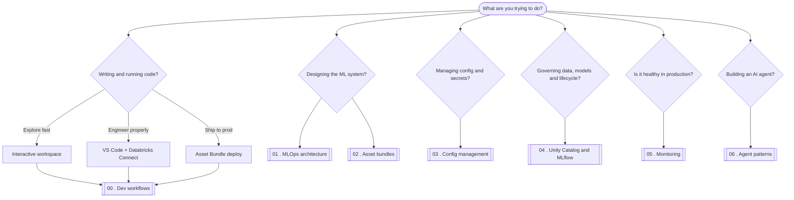

# Databricks MLOps Blueprint

An opinionated architectural reference for doing MLOps on Databricks. For each pillar of the platform it gives you a decision guide ("when to use what"), a diagram, and a small runnable notebook that compares the real options on a shared, real-world example. Where the official docs already explain the *how*, this links out ([docs/links.md](docs/links.md)) and spends its words on the trade-offs a tutorial skips.

The bias is insight over coverage: strategic framing and honest trade-offs, not a doc dump.

## Who it's for

Data scientists and ML engineers deciding how to do MLOps well on Databricks, and anyone who wants the reasoning behind the buttons rather than just the button names.

## When to use what

This map doubles as the table of contents. Start from the question you actually have.



> This map renders on GitHub. Inside the notebooks, the same diagrams render in the Databricks workspace, VS Code, or Jupyter.

## The pillars

| # | Notebook | The decision it helps you make |
|---|----------|--------------------------------|
| 00 | Dev workflows | Workspace vs VS Code + Connect vs Asset Bundle deploy |
| 01 | MLOps architecture | Deploy-code vs deploy-model; dev/staging/prod strategy |
| 02 | Asset bundles | DAB vs notebooks-only vs Terraform; multi-target CI/CD |
| 03 | Config management | Plain YAML vs widgets vs OmegaConf; secrets handling |
| 04 | Unity Catalog + MLflow | UC namespace + MLflow lifecycle; when to scale compute |
| 05 | Monitoring | Lakehouse Monitoring vs custom MLflow metrics vs SQL |
| 06 | Agent patterns | Genie vs Knowledge Assistant vs custom LLM; Vector Search |

Notebooks live at the repository root and are published incrementally; 00 is available today.

## The worked example

Every notebook runs end-to-end on one spine: **customer churn**, modelled on the public IBM Telco Customer Churn dataset (7,043 customers, 21 features). By default a notebook synthesizes a faithful stand-in, so it runs anywhere with zero setup; to swap in the real data, see [data/README.md](data/README.md). The agents notebook uses a document-QA corpus instead, since retrieval-augmented generation doesn't fit a churn table.

## Running the code

There are three ways to run on Databricks; notebook 00 covers when to reach for each.

1. **Interactive workspace** - import a notebook, attach a cluster, run cells. Best for fast exploration.
2. **VS Code + Databricks Connect** - edit locally with git, linting, and tests, then execute on a remote cluster. Best for real engineering.
3. **Asset Bundle deploy** - `databricks bundle deploy` ships versioned jobs and pipelines. Best for production and CI/CD.

Fill in the placeholders (catalog, schema, host) to run in your own workspace. No secrets are committed.

## Repository

```
0X_*.ipynb         the pillars (00-06) at the repo root, added incrementally
src/               importable code: config, data_pipeline, agents, utils
resources/         Asset Bundle job and pipeline definitions
databricks.yml     Asset Bundle definition (dev/staging/prod)
.github/workflows  CI (validate) and CD (deploy)
data/              local datasets (gitignored; see data/README.md)
docs/links.md      curated external references (the "how")
```

For the design rationale and the build roadmap, see [CONTEXT.md](CONTEXT.md) and [PLAN.md](PLAN.md).
