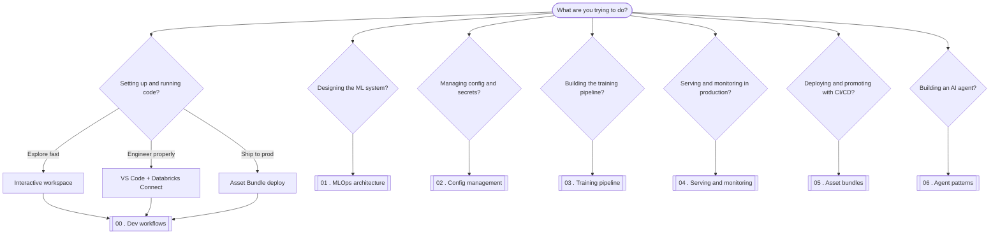

# Databricks MLOps Blueprint

An opinionated architectural reference for doing MLOps on Databricks. For each pillar of the platform it gives you a decision guide ("when to use what") and a diagram, backed by a worked example that runs the real options end-to-end on a shared, real-world dataset. Where the official docs already explain the *how*, this links out ([docs/links.md](docs/links.md)) and spends its words on the trade-offs a tutorial skips.

The bias is insight over coverage: strategic framing and honest trade-offs, not a doc dump.

The throughline is the shift from ad-hoc notebook data science to mature, CI/CD-driven engineering: logic modularised into `src/`, strict dev/staging/prod boundaries, and code-first deployment via Asset Bundles. Each pillar is framed as that transition rather than a feature tour.

## Who it's for

Data scientists and ML engineers deciding how to do MLOps well on Databricks, and anyone who wants the reasoning behind the buttons rather than just the button names.

## When to use what

This map doubles as the table of contents. Start from the question you actually have.



> This map renders on GitHub. Inside the notebooks, the same diagrams render in the Databricks workspace, VS Code, or Jupyter.

## The pillars

| # | Notebook | The decision it helps you make |
|---|----------|--------------------------------|
| 00 | Dev workflows | Workspace vs VS Code + Connect vs Asset Bundle deploy |
| 01 | MLOps architecture | The end-to-end loop; deploy-code vs deploy-model; dev/staging/prod |
| 02 | Config management | Plain YAML vs widgets vs OmegaConf; secrets handling |
| 03 | Training pipeline | Features + MLflow + Models in Unity Catalog; feature store; when to scale compute |
| 04 | Serving and monitoring | Model serving; Lakehouse Monitoring vs custom MLflow metrics; drift and retraining |
| 05 | Asset bundles | DAB vs notebooks-only vs Terraform; multi-target CI/CD; promotion |
| 06 | Agent patterns | Genie vs Knowledge Assistant vs custom LLM; Vector Search |

## Running the code

There are three ways to run on Databricks; notebook 00 covers when to reach for each.

1. **Interactive workspace** - import a notebook, attach a cluster, run cells. Best for fast exploration.
2. **VS Code + Databricks Connect** - edit locally with git, linting, and tests, then execute on a remote cluster. Best for real engineering.
3. **Asset Bundle deploy** - `databricks bundle deploy` ships versioned jobs and pipelines. Best for production and CI/CD.

Fill in the placeholders (catalog, schema, host) to run in your own workspace. No secrets are committed.

## Repository

```
0X_*.ipynb         the pillars (00-06) at the repo root, added incrementally
src/               importable code: config, data_pipeline, agents, utils
resources/         Asset Bundle job and pipeline definitions
databricks.yml     Asset Bundle definition (dev/staging/prod)
.github/workflows  CI (validate) and CD (deploy)
data/              local datasets (gitignored; see data/README.md)
docs/links.md      curated external references (the "how")
```
